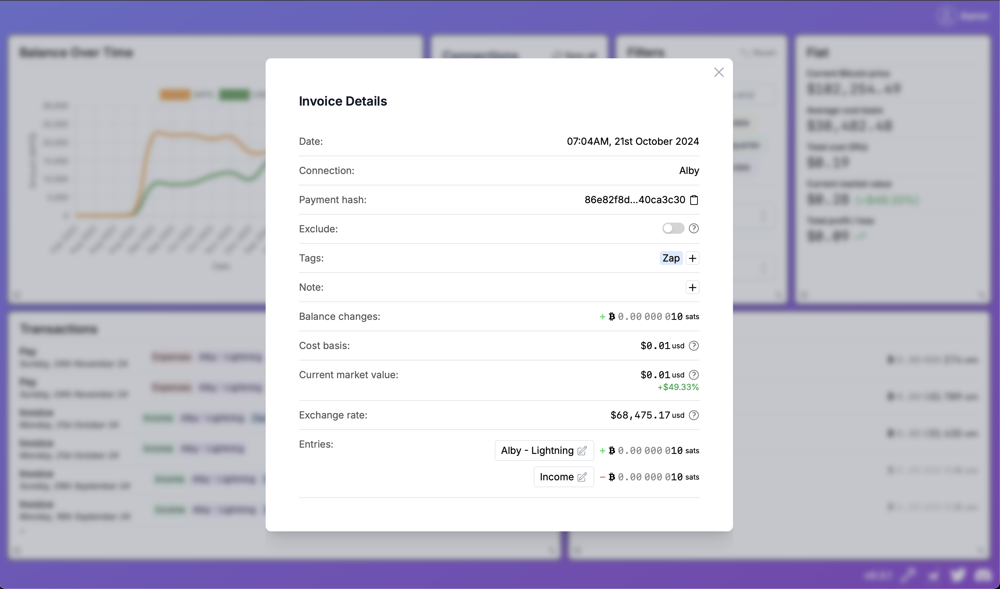

+++
title = "Release v0.3.0"
date = 2025-01-04
description = "We have added a Custom Import connection, which allows you to manually import csv transaction data..."
+++

# Features

- [Custom Imports](#custom-imports)
- [Transaction Details](#transaction-details)
- [DB Backup and Restore](#db-backup-and-restore)
- [Filter Widget Updates](#filter-widget-updates)
- [Cashu NIP60 Connection](#cashu-nip60-connection)

# Custom Imports

<div class="responsive-video">
<iframe width="560" height="315" src="https://www.youtube.com/embed/NXsq-qfSL4s?si=5OWDkLjmRaEmxqm2" title="YouTube video player" frameborder="0" allow="accelerometer; autoplay; clipboard-write; encrypted-media; gyroscope; picture-in-picture; web-share" referrerpolicy="strict-origin-when-cross-origin" allowfullscreen></iframe>
</div>

We have added a "Import" wallet connection, which allows you to manually import csv transaction data. This is useful for wallets and exchanges that we do not currently support an automatic sync connection. To get started, head to the connections widget and create a new "Import" connection. Once created, click the connection menu button on the right hand side and click "Import".

To ensure Clams recognizes your transactions, format your CSV file with the correct transaction types, column names, and values. This guide explains the required formats and provides examples for each type.

---

## Transaction Types

Your CSV file must include a `type` column, and each row must have a value that tells Clams how to process it. Below are the available transaction types, required/optional columns, and examples.

---

### **INVOICE**

A BOLT11 or BOLT12 Lightning invoice where funds are being received to a self-custodial Lightning wallet or node.

| **Column Name(s)**                           | **Required?** | **Value Type**           |
| -------------------------------------------- | ------------- | ------------------------ |
| `timestamp` or `date`                        | required      | Timestamp                |
| `amount_btc`, `amount_sat`, or `amount_msat` | required      | Amount BTC, SAT, or MSAT |
| `id` or `reference`                          | required      | ID                       |
| `request`                                    | optional      | Invoice Request          |
| `zap`                                        | optional      | Zap                      |

**Example CSV Snippet**:

```
type,timestamp,amount_btc,id,request,zap
INVOICE,2024-10-04T15:30:45Z,0.01234567,invoice123,lnbc1p3zjth0pp5qqqsyqcyq5rqwzqf...,true
```

---

#### **PAY**

A payment to a BOLT11 or BOLT12 Lightning invoice where funds are being sent from a Lightning wallet or node that is self-custodial.

| **Valid Column Name(s)**                     | **Required?** | **Value Type**           |
| -------------------------------------------- | ------------- | ------------------------ |
| `timestamp` or `date`                        | required      | Timestamp                |
| `amount_btc`, `amount_sat`, or `amount_msat` | required      | Amount BTC, SAT, or MSAT |
| `id` or `reference`                          | required      | ID                       |
| `request`                                    | optional      | Invoice Request          |
| `zap`                                        | optional      | Zap                      |
| `fee_btc`, `fee_sat`, or `fee_msat`          | optional      | Amount BTC, SAT, or MSAT |

**Example CSV Snippet**:

```
type,timestamp,amount_btc,id,fee_btc
PAY,2024-10-05T12:00:00Z,0.00567890,payment456,0.00004567
```

---

#### **DEPOSIT**

A deposit into a custodial wallet. This could involve depositing Bitcoin via Lightning or on-chain, or fiat into an exchange.

| **Valid Column Name(s)** | **Required?**                                                             | **Value Type**               |
| ------------------------ | ------------------------------------------------------------------------- | ---------------------------- |
| `timestamp` or `date`    | required                                                                  | Timestamp                    |
| `amount`                 | required                                                                  | Amount BTC or Fiat           |
| `id` or `reference`      | required                                                                  | ID or Lightning Payment Hash |
| `asset`                  | required                                                                  | Asset                        |
| `btc_destination`        | required if `asset` is BTC and `id` is not a valid lightning payment hash | BTC Destination              |
| `fee`                    | optional                                                                  | Amount BTC or Fiat           |

**Example CSV Snippet**:

```
type,timestamp,amount,asset,id
DEPOSIT,2024-10-06T14:25:00Z,500,USD,deposit789
```

---

#### **WITHDRAWAL**

A withdrawal from a custodial wallet. This could involve withdrawing Bitcoin via Lightning or on-chain or withdrawing fiat from an exchange.

| **Valid Column Name(s)** | **Required?**                                                             | **Value Type**               |
| ------------------------ | ------------------------------------------------------------------------- | ---------------------------- |
| `timestamp` or `date`    | required                                                                  | Timestamp                    |
| `amount`                 | required                                                                  | Amount BTC or Fiat           |
| `id` or `reference`      | required                                                                  | ID or Lightning Payment Hash |
| `asset`                  | required                                                                  | Asset                        |
| `btc_destination`        | required if `asset` is BTC and `id` is not a valid lightning payment hash | BTC Destination              |
| `fee`                    | optional                                                                  | Amount BTC or Fiat           |

**Example CSV Snippet**:

```
type,timestamp,amount,asset,id,btc_destination
WITHDRAWAL,2024-10-07T16:45:00Z,0.5,BTC,withdrawal101,bc1qxy2kgdygjrsqtzq2n0yrf2493p83kkfjhx0wlh
```

---

#### **TRADE**

A trade from one asset to another. This could involve buying or selling Bitcoin for fiat.

| **Valid Column Name(s)** | **Required?** | **Value Type**     |
| ------------------------ | ------------- | ------------------ |
| `timestamp` or `date`    | required      | Timestamp          |
| `from_amount`            | required      | Amount BTC or Fiat |
| `to_amount`              | required      | Amount BTC or Fiat |
| `fee_amount`             | optional      | Amount BTC or Fiat |
| `id` or `reference`      | required      | ID                 |
| `from_asset`             | required      | Asset              |
| `to_asset`               | required      | Asset              |
| `fee_asset`              | optional      | Asset              |
| `trade_id`               | optional      | ID                 |
| `order_id`               | optional      | ID                 |

**Example CSV Snippet**:

```
type,timestamp,from_amount,from_asset,to_amount,to_asset,fee_amount,fee_asset
TRADE,2024-10-08T18:00:00Z,0.1,BTC,3000,USD,5,USD
```

---

### Value Types

#### **Timestamp**

All timestamps need to be in UTC timezone and follow a valid RFC 3339 format, unix timestamp in seconds, or one of the custom formats below:
Examples:

- 2024-10-04T15:30:45Z
- 2024-10-04T15:30:45+00:00
- 2024-10-04T15:30:45.123Z
- 2024-10-04T15:30:45.123456Z
- 1728055845.123
- 2024-10-04T00:00:00Z
- 04/10/2024 5:07:59 AM

---

#### **ID**

A unique ID for this transaction. This can be any value as long as it is unique to the transaction and wallet. Examples:

- invoice123
- trade789

---

#### **Amount BTC**

Bitcoin denominated amount with up to 8 decimal places. Examples:

- 0.13850031
- 1.000045
- 0.00000001

---

#### **Amount SAT**

SATS denominated Bitcoin amount. Examples:

- 400
- 234

---

#### **Amount Fiat**

Fiat amount as a decimal. Examples:

- 4.32
- 9589.47

---

#### **Invoice Request**

A BOLT11 or BOLT12 Lightning invoice request. Example:

- lnbc1p3zjth0pp5qqqsyqcyq5rqwzqfqqqsyqcyq5rqwzqfqqqsyqcyq5rqwzqfqypqdpl2pkx2ctnv5sxxmmwwd5kgetjypeh2ursdae8gxqyjw5qcqpjrzjqwfn3p9278ttzzpe0e00uhyxhned3j5d9acqak5emwfpflp8zqpsp5lraer6xyeztnadn8m3rpppr5v2zx3l2r7t70rdjlxe2qup2n7tzs9qyyssqapu4gv3h9y8q2ds73xge4pxx5vet4nvavhxk4gs05vjcl2jr5jzr3zoxw4zaxz7rl6rs2lc3g2yxlqfpk8n6k5jfj9z4xr6z9l6wjlhrxqpl66lrm

---

#### **BTC Destination**

An on-chain address, BOLT11 invoice, or BOLT12 invoice. Examples:

- bc1qweq8vxpsvx3d89uvp65qgwjql68s4e43csgtvf
- lnbc1p3zjth0pp...

---

#### **Zap**

Boolean indicating if this is a NOSTR zap. Examples:

- true
- false

---

#### **Asset**

The asset being transacted. Examples:

- BTC
- USD
- EUR
- GBP
- CNY
- JPY
- CAD
- AUD
- HKD
- SGD
- SEK
- CHF
- THB
- PLN
- NOK
- MYR
- DKK
- ZAR
- NZD
- MXN
- RUB

---

### Checklist Before Uploading

- [ ] File includes a `type` column with valid transaction types.
- [ ] All required columns for each type are filled.
- [ ] Timestamps follow UTC and a supported format.
- [ ] Values are correctly formatted (e.g., BTC amounts, SATs, or fiat).

If your file meets these requirements, you’re ready to upload it to Clams.

# Transaction Details

<div class="responsive-video">
<iframe width="560" height="315" src="https://www.youtube.com/embed/juClH0oKiDU?si=FHA3MJUBWAmiHoVx" title="YouTube video player" frameborder="0" allow="accelerometer; autoplay; clipboard-write; encrypted-media; gyroscope; picture-in-picture; web-share" referrerpolicy="strict-origin-when-cross-origin" allowfullscreen></iframe>
</div>

Click on a transaction row in the transactions widget to display it's details:


## General Details

Included are general details like the date and time, connection and id (hash/txid) that are associated with the transaction for cross referencing to the full details in your wallet.

## Exclude

You can switch the toggle to exclude this transaction from any of the calculations displayed in the widgets. This can be useful if you might have been temporarily custodying funds for a friend or family, and it is not really related to your transaction activity.

## Tags

Tags are a way of categorizing transactions so that you can easily filter and quickly recognize them. Clams will try to add intelligent default tags when possible. The tags section allows for adding and removing tags to a particular transaction, as well as managing tags in general by creating new ones or deleting existing ones. Tag filtering has also been added to the filters widget for filtering to particular tags.

## Note

You can add a text note for a transaction to provide additional context that might not be covered by tags and accounts.

## Balance Changes and Cost Basis

This section will give a summary that is similar to the Fiat widget, but at a per transaction level. You can see the balance changes in sats, the cost basis, the current value in fiat and the exchange rate at the time of the transaction.

## Entries and Custom Accounts

This section shows how the transaction is represented in double entry accounting journal entries with debits and credits and the accounts affected. You can think of accounts as being like a category. All credits and debits must go in to at least one of the top level accounts: Income, Expenses, Assets, Liabilities and Equity. Clams will automatically do this for you at the most granular level it can. The entries section allows you customise the account for each debit/credit to further categorize them. You cannot change the top level account (eg change income to expense), but you can create new sub accounts and select them to make them more specific. For example a transaction might be in the "Income" account. You might want to create a sub account called "Day Job" and select that which will then indicate that income came from your day job, whereas a zap transaction you might add a sub account "Nostr" indicating that income was derived from Nostr. For an Expense, maybe you create a sub account called "Rent" which indicates this transaction was paying your rent. Or maybe a new sub category like "Payroll" etc.
By adding more specific accounts and categorizing your credits and debits, this allows you to use the filters to answer questions like "How much did I spend on food in the last month?". Or "what was our payroll for the last quarter?",

# DB Backup and Restore

<div class="responsive-video">
<iframe width="560" height="315" src="https://www.youtube.com/embed/yZALFOBYinM?si=erJpmdTFIotz9W51" title="YouTube video player" frameborder="0" allow="accelerometer; autoplay; clipboard-write; encrypted-media; gyroscope; picture-in-picture; web-share" referrerpolicy="strict-origin-when-cross-origin" allowfullscreen></iframe>
</div>

Now that you can manually import data and add custom metadata via tags, custom accounts and notes, it is important to be able to back up your data. There are a couple of additions to the settings modal (click the wrench at the bottom right to open) that will allow you to backup and restore your data. Click the "Backup data" button to take a snapshot of your data. It will be saved to the data directory for the Clams app. Doing this regularly, especially after adding new connections or data is good practice. If you ever mess something up and want to go back to a previous snapshot, then click the "Restore from backup" button. This will display all of your data snapshots (and the location if you want to copy and store on a separate hard drive for redundancy) and you will notice the filename includes the date and a timestamp. Select the DB file that you would like to load and Clams will then run on the selected DB file. For safety Clams will also keep a copy of your current data snapshot just in case you do want to go back to that state.

# Filter Widget Updates

<div class="responsive-video">
<iframe width="560" height="315" src="https://www.youtube.com/embed/Z1_HMG9FQ7M?si=cVTOzai8oP5APqzK" title="YouTube video player" frameborder="0" allow="accelerometer; autoplay; clipboard-write; encrypted-media; gyroscope; picture-in-picture; web-share" referrerpolicy="strict-origin-when-cross-origin" allowfullscreen></iframe>
</div>

There is a new section that allows for filtering by tags which is extra useful if you have added tags to your transactions or to make use of the default tags that Clams automatically adds for you.
It is also now possible to select multiple items in the dropdown to allow filtering for multiple accounts or tags.

# Cashu NIP60 Connection

<div class="responsive-video">
<iframe width="560" height="315" src="https://www.youtube.com/embed/M9_2DA1tUSs?si=LHCutnS6Z8RHQMuN" title="YouTube video player" frameborder="0" allow="accelerometer; autoplay; clipboard-write; encrypted-media; gyroscope; picture-in-picture; web-share" referrerpolicy="strict-origin-when-cross-origin" allowfullscreen></iframe>
</div>

We built this connection whilst participating in the btc++ Ecash conference hackathon in Berlin last year and decided to go ahead and release it for anyone who is on the bleeding edge of Ecash and Nostr. NIP60 is a standard for having a Cashu Ecash wallet where the Ecash is stored on Nostr relays, makling a user balance accessible in any Nostr app.
